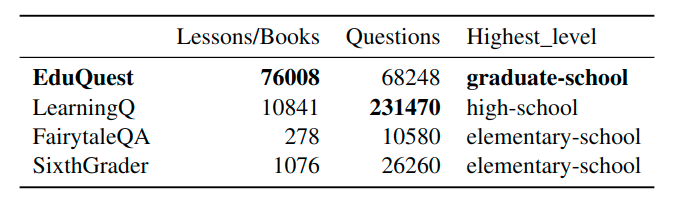
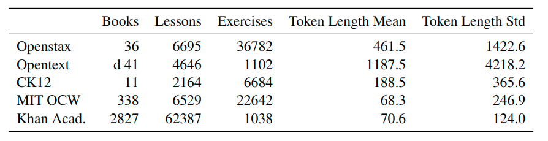
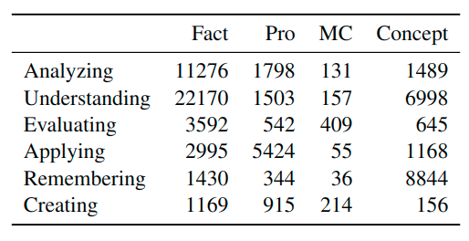

# EduQuest
This repository contains the **EduQuest** dataset, composed of `68248` questions developed by professional instructors for higher education learning. The dataset focuses on advanced and complex questions, to acess and train both students and machine learning algorithms.

## Dataset Statistics

<p align="middle">
    
    
</p>

The table on the left contains the core statistics of the dataset. On the right, a breakdown of the EduQuest dataset by source text. Books refers to one full course, with the exact definition
varying across source texts. For Openstax, Opentext and CK12 each book represents a graduate, undergraduate
or high-school level textbook. For MIT OCW, each book corresponds to one lecture series given at graduate or
undergraduate level. For Khan Academy, each book represents one URL in the source website.

<p align="middle">

</p>

Above is the statistics of the dataset broken down according to their respective cognitive process and knowledge dimensions (Factual - Fact, Procedural - Pro,
MetaCognitive - MC and Conceptual - Concept)

## Dataset Structure
The main structure is the same for all subgroups:

| Book   | Chapter | text                        | is_question | truefalse | fillblank | mc   |
| ------ | ------- | --------------------------- | ----------- | --------- | --------- | ---- |
| Origin | Chapter | Text of Lecture or Question | 1/0         | 1/0       | 1/0       | 1/0  |

- `is_question` indicates if text contains a lecture or a question

- `truefalse` is 1 if the question is of a true false type

- `fillblank` is 1 if the question is of a fillblank type (can also be `mc` simultanously)

- `mc` is 1 if the question is a multiple choice type

- `length` indicates the number of characters in `text`

- `num_words` indicates the number of words in `text`

- `num_sentences` indicates the number of sentences in `text`

- `dimension` The dimension in the revised Bloom's Taxonomy.

- `cognitive_process_dimension_level` cognitive dimension level in the revised Bloom's Taxonomy.

- `knowledge_dimension_level` knowledge dimension level in the revised Bloom's Taxonomy.

- Regarding Blooms Taxonomy, the following one hot encoded columns are here for convenience, a `1` indicates the question belongs to that level, `0` that it does not as Blooms Taxonomy does not require exclusivity.

  ```
  'Analyzing', 'Understanding', 'Evaluating', 'Applying', 'Remembering', 'Creating', 'conceptual_knowledge','factual_knowledge', 'procedural_knowledge', 'metacognitive_knowledge'
  ```


Because not all sources did indicate whether a question was of Multiple-Choice, True or False, Fill in the Blank or other types, it had to be inferred.
For openstax, the above flags should be mostly exclusive. 
I.e. if `truefalse == 0` then the question should not be of `truefalse` type, because the type of questions were largely indicated in the source materials.
For the other dataset sub-groups `ck12, KhanAacademy, OCW, Opentext` this does not have to be the case.
I.e. some questions in `CK12` with `truefalse == 0` could still be of `truefalse` type.
Similar with the other flags.

For more information please refer to the paper.


### By Group

detailed info on the flags and properties of this subgroup, certain datasets have a few indicators that we were able to extract to use for more specialized purposes, these columns are explained below.

#### Openstax

- `key_terms` if the text is a summary of key terms from the section or chapter
- `references` if the text is a list of references used in the previous lecture
- `summary` if the text is a summary of the chapter.
- `question_answers` if the text is an answer to a question
- `open_ended` if the question is an open ended question (as indicated by openstax)
- `concept` if the question is a concept check type from openstax

#### CK12

no special columns

#### Khan Academy

- `paragraph_order` each many of the lessons on Khan are split into multiple paragraphs. This is the intended reading order from the website. I.e. Article `X` starts with `X` ,`paragraph_order == 1`, then `X`, `paragraph_order == 2` and so on.
- `description` and `translated_descr` sometimes contain the original text before it was split by paragraphs
- `images` and `widgets` to our knowledge indicate if the scraped page were images or widgets, altough we did not find any usefulness in it.
- 

#### MIT OCW

- `is_exam` If the question is part of an exam (these comprise content spanning several lectures)
- `is_answer` If the text is an answer to a question, if yes, it should have an `q_id` associated with that row that indicates which question/exercise this is the answer for.
- `q_id`

#### Opentext / Libretexts

- `is_learning_objective` many textbooks from opentext included learning objectives at the beginning of each chapter. These are indicated here.

## Using this Dataset

### From this repo
To start with this dataset, either clone the repo or download it as a zip file.

```quick_start.py``` contains some code to train a model on the dataset, as an example to get started with NLP on **EduQuest**.

## Future Work

